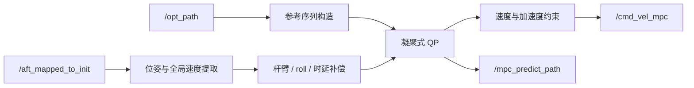

# 🎮 MincoMpcController

> 面向全向哨兵底盘的 Nav2 Controller 插件：以 MINCO 轨迹为参考，使用凝聚式 QP MPC 在 SE(2) 状态空间输出全局坐标系速度指令。

[返回项目主页](../../../README.md) · [MINCO Planner](../minco_planner/README.md)

## ✨ 模块定位

`minco_controller::MincoMpcController` 实现 `nav2_core::Controller`，订阅规划器生成的 `/opt_path` 与 Point-LIO 里程计，在 Nav2 Controller Server 的控制周期内求解 MPC。当前主配置控制频率为 **100 Hz**。

主要特性：

- 状态 `x = [px, py, yaw]`，控制 `u = [vx, vy, wz]`。
- qpOASES 求解凝聚后的有约束二次规划。
- 单调推进参考索引，减少高速运动时参考点回跳。
- 速度、角速度及相邻控制量差分约束。
- 控制时延、雷达到底盘参考点杆臂及车体 roll 补偿。
- 支持固定角速度小陀螺模式与 yaw 优化轨迹。
- 发布预测轨迹，提供求解耗时与频率统计。

## 🧠 模块流程图



### 流程概述

控制器以 `/opt_path` 中的 P/V/A/J 与 yaw 参考构造有限时域序列，同时从 latest-state odom 提取当前 SE(2) 状态。完成杆臂、固定 roll 和控制时延补偿后，将跟踪问题凝聚为只包含控制量的 QP；qpOASES 求解后应用速度死区、目标停车和 speed limit，最后通过 `/cmd_vel_mpc` 输出世界坐标系速度。

## 🧪 技术方向

- 状态为 `[x, y, yaw]`，控制为 `[vx, vy, wz]`，通过固定 `dt` 的离散模型预测有限时域状态。
- 代价由状态跟踪误差 `Q` 和控制参考误差 `R` 构成；速度、角速度和相邻控制量差分由 QP 上下界约束。
- 参考索引单调前进，并结合 `control_delay_compensation` 前移参考，减少高速运动时跟踪旧参考。
- Planner 输出的速度/加速度等前馈会进入 MPC 参考构造；上游热启动和轨迹边界状态会直接影响控制器收到的参考速度。

## ⚡ 性能方向

- 将状态消元后求解凝聚 QP，限制 100 Hz 控制周期内的决策变量规模。
- odom 订阅使用 `KeepLast(1) + best_effort + volatile`，只消费最新状态，避免高频定位消息排队。
- `/opt_path` 使用 `SystemDefaultsQoS`；控制与预测可视化 publisher 深度为 1，避免历史控制结果积压。
- `MpcPerformanceMonitor` 在开关启用时记录求解耗时、完整周期耗时、控制频率、命令/参考速度和 odom 回调延迟；关闭时不写 CSV。

## 🌐 坐标系与输出约定

控制器从 odom 四元数提取 yaw，将雷达参考点速度转换并补偿到底盘控制参考点。输出的 `vx/vy` 保持为**全局坐标系速度分量**，用于当前下位机通信约定；不要默认把它当作 `base_link` 局部速度。

杆臂速度关系可概括为：

```text
v_base = v_lidar + ω × r
```

其中 `r` 的符号取决于配置中“雷达参考点相对底盘参考点”的定义。修改安装位置后，Planner 与 Controller 必须同步校核。

## 📡 ROS 接口

| 方向 | Topic | 类型 | 说明 |
|---|---|---|---|
| 输入 | `/opt_path` | `ros_interfaces/msg/MpcPositionCommand` | MINCO 位置、速度、朝向参考 |
| 输入 | `/aft_mapped_to_init` | `nav_msgs/msg/Odometry` | 当前位姿、速度与角速度 |
| 输出 | `/cmd_vel_mpc` | `geometry_msgs/msg/Twist` | 提供给 communication / 底盘链路的控制量 |
| 输出 | `/mpc_predict_path` | `nav_msgs/msg/Path` | MPC 预测轨迹可视化 |

Nav2 标准接口 `setPlan()`、`computeVelocityCommands()` 和 `setSpeedLimit()` 仍由插件实现；项目主链路的高阶轨迹信息来自 `/opt_path`。

## ⚙️ 关键参数

配置位于 `src/navigation/navi2_bringup/params/sentry1.yaml` 的 `controller_server.ros__parameters.FollowPath`。

| 参数 | 当前典型值 | 说明 |
|---|---:|---|
| `controller_frequency` | `100.0` | Controller Server 调用频率 |
| `dt` | `0.05` | MPC 预测离散步长，不等同于控制周期 |
| `lookahead_time` | `0.5` | 参考轨迹前视时间 |
| `control_delay_compensation` | `0.05` | 控制链路时延预测 |
| `Q` | `[3, 3, 2]` | x、y、yaw 跟踪权重 |
| `R` | `[1.5, 1.5, 1]` | vx、vy、wz 输入权重 |
| `vx/vy_min/max` | `±3.0` | 全局平移速度约束 |
| `omega_min/max` | `±5.0` | 角速度约束 |
| `use_acc_constraints` | `true` | 启用相邻控制量差分约束 |
| `ax/ay_min/max` | `±2.0` | 平移加速度约束 |
| `alpha_min/max` | `±5.0` | 角加速度约束 |
| `use_small_gyro_mode` | `false` | 固定角速度小陀螺模式 |
| `fixed_wz` | `4.18` | 小陀螺目标角速度 |

### 📐 杆臂与姿态补偿

```yaml
lidar_offset_x: 0.0
lidar_offset_y: -0.20
lidar_roll_offset: 0.1745
```

- `lidar_offset_x/y`：里程计参考点与底盘控制参考点的平面偏移。
- `lidar_roll_offset`：安装姿态导致的固定横滚补偿。
- 三者均是实体标定量，不应仅凭轨迹观感随意调整。
- 修改后应低速验证原地旋转、纯 x/y 平移和组合运动，确认补偿方向正确。

## 🚀 启动与检查

控制器随 Nav2 完整启动：

```bash
ros2 launch navi2 navigation2.launch.py
```

运行时检查：

```bash
ros2 topic hz /opt_path
ros2 topic hz /aft_mapped_to_init
ros2 topic hz /cmd_vel_mpc
ros2 topic echo /cmd_vel_mpc --once
```

在 RViz 中叠加 `/opt_path_vis` 与 `/mpc_predict_path`，可快速判断误差来自参考轨迹还是控制器预测。

## 📈 性能观测

`performance.enable` 为总开关，`print_enable`、`detailed_csv_enable` 和 `odom_sub_debug_enable` 分别控制终端摘要、逐周期 CSV 和 odom 订阅窗口统计。当前比赛 YAML 中总开关与 `print_enable` 为开启，详细 CSV 与 odom 窗口统计关闭；由于周期样本只在 detailed CSV 开启时采集，默认不会记录逐周期求解 CSV。详细性能 CSV 默认路径：

```text
/tmp/mpc_perf_detailed.csv
```

字段包含 `success`、`solve_time_ms`、`cycle_time_ms`、`controller_hz`、`cmd_vx/vy/wz` 和 `ref_vx/vy/wz`，并可附带 `run_id/scenario/variant`。`csv_flush_every_n` 用于降低刷盘频率。

重点关注控制回调实际频率、QP 求解 P95/P99、失败次数，以及命令速度与参考速度的稳态差。100 Hz 控制要求 CSV、终端日志和可视化不能阻塞主回调。

## ⚠️ 已知问题与改进方向

- 当前电控速度跟随存在稳态误差，上游 Planner 因而强制保留热启动速度/加速度前馈。该补偿会提高参考速度，但不能替代底盘速度闭环标定；应联合对比 `ref_v*`、`cmd_v*` 与底盘反馈。
- 模型是速度层 SE(2) 运动学模型，未显式描述轮胎侧滑、电机/底盘执行延迟变化和速度闭环动态；高加速度、坡面或碰撞扰动下模型误差会增大。
- `/opt_path` 与 odom 使用不同 QoS 语义：轨迹为系统默认 QoS，odom 为 best-effort latest-state。诊断“无控制输出”时必须分别检查两条订阅是否匹配。
- 预测轨迹用于诊断，不代表底盘真实执行路径；实际闭环效果需结合 odom、communication CSV 和下位机反馈判断。

## 🛠️ 常见问题

| 现象 | 优先检查 |
|---|---|
| `/cmd_vel_mpc` 无输出 | Nav2 lifecycle、是否收到 `/opt_path` 与 odom |
| 速度方向与车体直觉不一致 | 输出为全局速度；核对下位机坐标约定 |
| 原地旋转伴随平移 | 杆臂偏移符号、雷达安装位置和角速度单位 |
| 高频振荡 | `Q/R` 比例、时延补偿、参考密度、加速度约束 |
| 跟踪明显滞后 | odom/轨迹时间戳、控制延迟、前视时间和下位机延迟 |
| QP 不可行 | 初始状态偏差、速度/加速度边界和参考突变 |
| 小陀螺退出异常 | 上层模式切换是否恢复参数与固定角速度配置 |

## 🗂️ 关键源码

- `src/minco_mpc_controller.cpp`：插件生命周期、参考构造、补偿、QP 与输出。
- `include/minco_controller/minco_mpc_controller.hpp`：状态、参数与接口定义。
- `minco_controller.xml`：pluginlib 注册信息。
- `src/navigation/navi2_bringup/params/sentry1.yaml`：比赛主参数。

## 📚 延伸阅读

轨迹如何生成见 [MincoPlanner 文档](../minco_planner/README.md)，系统启动和通信链路见[项目主 README](../../../README.md)。
