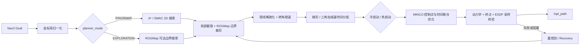

# 🧭 MincoPlanner

> 面向 RoboMaster 哨兵机器人的 Nav2 全局规划插件：以离散搜索提供拓扑引导，以 ROGMap / ESDF 提供局部环境约束，以 MINCO 生成可实时执行的平滑轨迹。

[返回项目主页](../../../README.md) · [MPC 控制器](../minco_controller/README.md) · [ROGMap](../../perception/rog_map/README.md)

## ✨ 模块定位

`minco_planner::MincoPlanner` 实现 `nav2_core::GlobalPlanner`。Nav2 调用 `createPlan()` 时，插件完成坐标系归一化并更新待处理目标；真正的搜索、优化、重规划与安全检查由内部 FSM 周期执行。规划结果通过自定义轨迹消息发送给 MPC，而不是仅输出离散 `nav_msgs/Path`。

核心能力：

- `PRIORMAP`：基于 Nav2 全局代价地图进行全局搜索，适合先验地图导航。
- `EXPLORATION`：基于 ROGMap 搜索局部可达区域及边界候选。
- 路径裁剪、稀疏化与时间分配，降低优化维度。
- MINCO 多项式轨迹优化，同时约束速度、加速度、障碍距离与终端状态。
- 轨迹热启动、在线重规划、连续安全检查与受控恢复。
- 直接查询 ROGMap / ESDF，避免为规划查询重复序列化大地图。

## 🧠 模块流程图



### 流程概述

技术主线可概括为：

```text
A* / SMAC 搜索
  → 按机器人当前位置截取局部前视段
  → 按 ROGMap 有效边界裁剪
  → line-of-sight 稀疏化
  → 转角限速与梯形/三角加减速预分配
  → 冷/热启动初值
  → MINCO 优化
  → 发布前硬校验
```

搜索层提供离散拓扑引导；局部处理层把长路径压缩为有限前视范围内的少量控制点；时间预分配根据段长、转角、速度和加速度给出接近可行的初值；MINCO 再联合优化分段多项式控制点与持续时间。发布前以 `0.05 s` 步长检查严重速度/加速度越界、终点误差和 ROGMap/ESDF 碰撞。

## 🧪 技术方向

- `PRIORMAP` 使用 Nav2 costmap 上的 A*/SMAC 搜索提供全局拓扑，ROGMap 负责局部动态查询；`EXPLORATION` 直接从 ROGMap 搜索可达边界。
- `LocalPathProcessor` 先按 `lookahead_dist` 截取，再按 ROGMap 边界和 margin 裁剪，避免优化器访问无有效局部地图的区域。
- 稀疏路径经过 line-of-sight 检查、转角局部限速、前后向速度传播，以及梯形/三角加减速时间分配。
- 位置轨迹采用 MINCO 分段多项式；代价包含平滑、ESDF 位置、速度、加速度、waypoint 吸引、时间和时间屏障等软代价。
- FSM 管理目标等待、生成、跟踪、持续安全检查和恢复；当前轨迹不安全或规划失败时进入重规划/恢复链路。

## ⚡ 性能方向

- 局部前视截取和路径稀疏化是限制优化规模的主要手段，避免将完整全局路径直接作为优化变量。
- ROGMap 通过进程内 `MapQueryInterface` 提供 occupancy、projection 和 ESDF 查询，不为每次优化序列化完整地图。
- odom 订阅使用 `KeepLast(1) + best_effort + volatile`，强调 latest-state，避免高频里程计积压。
- `/opt_path` 与普通路径可视化使用深度 1；候选轨迹、A* 路径和控制点可视化使用 `transient_local` 深度 1，便于 RViz 后加入时取得最近结果。
- `PlannerPerformanceMonitor` 可按开关记录搜索、局部处理、优化、总重规划耗时、规划频率、成功状态和失败原因；详细字段见“性能观测”。

## 🔄 状态机

主要状态为：

| 状态 | 职责 |
|---|---|
| `INIT` | 等待里程计、地图查询接口等必要条件 |
| `WAIT_GOAL` | 等待新目标；已有目标更新时进入规划 |
| `GENERATE_TRAJ` | 搜索路径、构造初值并执行轨迹优化 |
| `FOLLOW_TRAJ` | 发布并监测当前轨迹，按条件触发重规划 |
| `RECOVERING` | 执行局部脱困并在成功后重新规划 |

> 状态名不等于所有分支均处于当前主路径。判断实际行为时应以 `minco_fsm.cpp` 中未注释的状态转移为准。

## 📡 ROS 接口

### 输入

| 类型 | 名称 | 说明 |
|---|---|---|
| Nav2 API | `createPlan(start, goal)` | 接收规划请求并更新内部目标 |
| `nav_msgs/msg/Odometry` | `/aft_mapped_to_init` | 位姿、速度与轨迹起始状态 |
| 内部查询 | `MapQueryInterface` | ROGMap 占据、投影层与 ESDF 查询 |
| Nav2 Costmap | `planner_server` costmap | `PRIORMAP` 模式的全局搜索依据 |

### 输出与可视化

| Topic | 类型 / 用途 | 当前 QoS 要点 |
|---|---|---|
| `/opt_path` | `ros_interfaces/msg/MpcPositionCommand`，MPC 主参考轨迹 | `KeepLast(1)` |
| `/backup_path` | 兼容性轨迹通道；当前文档不将其作为主规划能力 | `KeepLast(1)` |
| `/opt_path_vis` | 已接受优化轨迹 | `KeepLast(1)` |
| `/minco_candidate_path_vis` | 发布前候选轨迹与拒绝诊断 | `KeepLast(1) + transient_local` |
| `/astar_path_vis` | 离散搜索路径 | `KeepLast(1) + transient_local` |
| `/minco_control_points_vis` | MINCO 控制点 | `KeepLast(1) + transient_local` |
| `/recover_path`, `/recover_goal` | 恢复过程诊断 | `KeepLast(1)` |

## ⚙️ 关键配置

主配置位于 `src/navigation/navi2_bringup/params/sentry1.yaml` 的 `planner_server.ros__parameters.MincoPlanner`。

### 模式与坐标系

| 参数 | 当前典型值 | 含义 |
|---|---:|---|
| `planner_mode` | `PRIORMAP` | `PRIORMAP` / `EXPLORATION` |
| `odom_topic` | `/aft_mapped_to_init` | Point-LIO 里程计 |
| `frames.map_frame` | `map` | 先验地图规划坐标系 |
| `frames.rog_frame` | `camera_init` | ROGMap 与局部轨迹坐标系 |
| `use_smac` | `true` | 先验地图模式使用 SMAC 2D 搜索 |

### 轨迹与安全

| 参数组 | 作用 | 调参影响 |
|---|---|---|
| `minco_optimizer.max_velocity`, `max_acceleration` | 线速度、线加速度上限 | 过高会增加跟踪压力，过低会降低机动性 |
| `minco_optimizer.safe_dist` | ESDF 优化及轨迹安全余量 | 应与车体外形和地图膨胀共同确定 |
| `minco_optimizer.collision_dist` | 预留碰撞距离参数 | 当前发布前碰撞检查以 `safe_dist` 配置的安全检查器为准 |
| `minco_optimizer.lookahead_dist` | 局部优化前视长度 | 越大越平滑，但控制点、计算量与局部地图依赖增加 |
| `minco_optimizer.integral_res` | 代价积分采样密度 | 越高越精细，也越耗时 |
| `minco_optimizer.enable_yaw_opt` | 是否优化朝向轨迹 | 隧道、侧移和高速转向需结合控制器验证 |
| `recovery_server.*` | 连续失败阈值、冷却与脱困参数 | 影响阻塞后的恢复激进程度 |

### 📐 Planner 杆臂补偿

`lidar_offset_x/y` 描述雷达/里程计参考点相对底盘控制参考点的平面偏移。当前典型配置为：

```yaml
lidar_offset_x: 0.0
lidar_offset_y: -0.20
```

该补偿会影响规划初始状态。它必须与 Point-LIO 发布的参考点、控制器中的同名偏移及实体安装方向一致。不要通过修改该参数修补错误的 TF；先确认坐标轴方向和偏移定义。

## 🚀 启动与检查

本模块通常随完整导航启动，不建议独立启动插件：

```bash
ros2 launch navi2 navigation2.launch.py
```

启动后可检查：

```bash
ros2 topic hz /aft_mapped_to_init
ros2 topic hz /opt_path
ros2 topic echo /opt_path --once
ros2 param get /planner_server MincoPlanner.planner_mode
```

推荐在 RViz 同时观察 `/astar_path_vis`、`/opt_path_vis`、ROGMap 占据层和 ESDF，区分“搜索不可达”“优化失败”和“地图输入异常”。

## 📈 性能观测

`performance.enable` 是性能监视总开关；`print_enable`、`detailed_csv_enable` 和 `odom_sub_debug_enable` 分别控制终端摘要、逐次 CSV 和 odom 订阅统计。当前比赛 YAML 默认关闭 Planner 性能统计。详细 CSV 默认写入：

```text
/tmp/minco_perf_detailed.csv
```

CSV 记录 `planner_mode`、`success`、`failure_reason`、`global_search_time_ms`、`local_search_time_ms`、`optimizer_time_ms`、`total_replan_time_ms` 和 `planner_hz`，并可附带 `run_id/scenario/variant`。`csv_flush_every_n` 控制批量 flush，避免逐行同步刷盘成为新的实时性瓶颈。

在线调参时应同时观察 P95/P99 耗时、失败原因、轨迹接受率和实际可执行性；单次优化很快并不等于动态避障链路足够灵敏。

## ⚠️ 已知问题与改进方向

### 热启动是当前实车折中

电控速度闭环存在稳态跟踪误差，冷启动若直接采用实测速度，会压低新轨迹的初始速度前馈。当前 `determinePlanningState()` 在位置误差或速度误差超阈值时仍返回 `HOT_START`，强制继承旧轨迹速度/加速度，以维持速度前馈。这是实车跟随问题下的工程折中，不是理想热启动判据。

热启动边界状态目前混用了两套来源：

- 起始位置使用最新 odom：`start_pose.position`；
- 起始速度、加速度使用旧轨迹在 `t_dur` 的期望值；
- 源码中“使用旧轨迹期望位置”的实现仍被注释。

因此，新轨迹起点保持与实车位置连续，但 P/V/A 并非来自同一个轨迹状态。跟踪误差较大时可能造成边界状态不一致；后续应在电控跟踪、轨迹连续性和可行性之间重新验证热启动策略。

### 主优化缺少安全走廊硬约束

当前主 MINCO 优化依赖 ESDF、动力学和 waypoint 等软代价，没有把搜索路径对应的安全走廊作为优化变量的硬几何约束。`corridor` 生成器目前用于 backup trajectory，不约束主优化轨迹。发布前虽有动力学、终点和 ESDF 离散采样校验，但它属于事后拒绝，不能从求解空间中排除所有畸形候选。

此外，总代价上限 `max_allowed_cost` 的拒绝逻辑当前被注释，优化结果只先检查 `final_cost` 是否有限，再进入轨迹采样校验。极端初值、地图梯度或代价权重组合下仍可能出现形状异常但数值有限的候选解；应优先评估安全走廊约束、尺度归一化和更明确的质量门控，而不是继续堆叠未经验证的固定权重。

### 动态避障响应不够灵敏

动态避障能力由点云与地图刷新、全局/局部路径更新、FSM 重规划触发、旧轨迹复用、安全门控和新轨迹接受共同决定，不是优化耗时一个指标。当前策略在动态障碍出现后可能继续复用仍被判定安全的旧轨迹，或因新轨迹被门控拒绝而延迟切换；现场表现为避障反应不够敏捷。

改进时应先用 CSV 和可视化对齐“障碍进入地图 → ESDF 更新 → 重规划开始 → 新轨迹接受”的时间线，再调整重规划触发和轨迹接受策略，避免单纯提高规划频率或减小安全距离。

## 🛠️ 常见问题

| 现象 | 优先检查 |
|---|---|
| 一直停留在 `INIT` | 里程计、ROGMap 创建、坐标系与生命周期状态 |
| 有搜索路径但无 `/opt_path` | 时间分配、初值、ESDF、安全距离和优化器返回状态 |
| 轨迹贴障或穿障 | 点云时延、ROGMap 投影高度、ESDF 更新、安全/碰撞距离 |
| 频繁重规划 | 地图抖动、目标更新频率、重规划条件、速度/加速度约束 |
| 起步方向或速度异常 | Planner 与 Controller 杆臂参数、odom 参考点和 yaw 定义 |
| `EXPLORATION` 无结果 | 起点是否位于 ROGMap、局部边界是否存在可达候选 |

## 🗂️ 关键源码

- `src/minco_core/minco_planner.cpp`：插件配置、目标接入、地图创建与参数更新。
- `src/minco_core/minco_fsm.cpp`：规划状态机与重规划逻辑。
- `src/minco_core/components/global_path_searcher.cpp`：两种模式的全局/局部搜索。
- `src/traj_opt/minco_optimizer.cpp`：MINCO 优化入口。
- `src/minco_core/components/trajectory_safety_checker.cpp`：轨迹安全查询。
- `include/minco_core/`：插件、FSM 与组件接口。

## 📚 延伸阅读

系统级安装、启动顺序与完整参数关系见[项目主 README](../../../README.md)。地图内部结构见 [ROGMap 文档](../../perception/rog_map/README.md)，轨迹执行见 [MPC 控制器文档](../minco_controller/README.md)。
